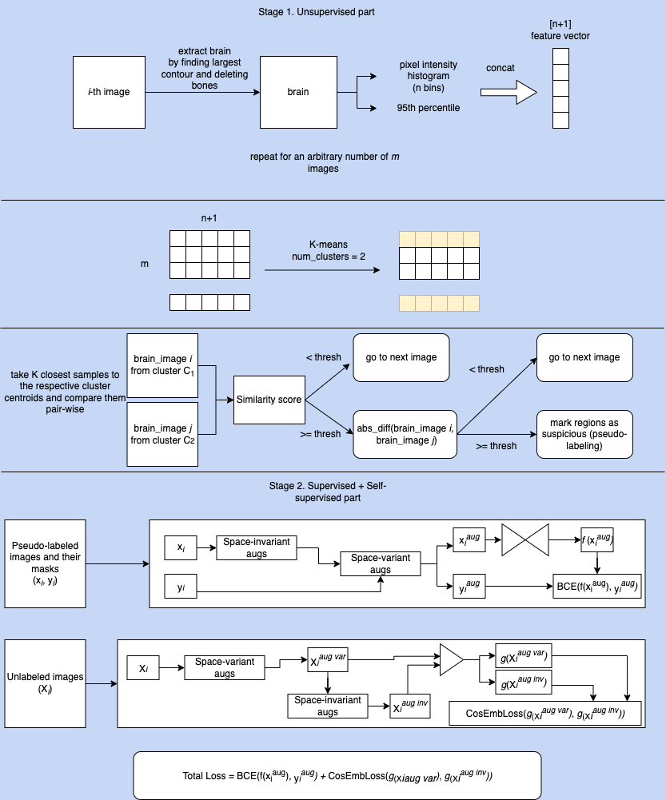

# About
Solution to Innopolis Global AI Challenge 2023: AI4MED.
This code includes both stages (unsupervised and supervised + self-supervised) and submission generation.
The entire architecture is illustrated below. Some minor steps were skipped.

# How to train the network
First, we have to generate pseudo masks in an unsepervised fashion. 
Original images are located in the **data/competition/competition** directory. 
Run explore.py, it will do the following:
1) extract brain from the original images (generate_brains), where it's possible, based on the assumption that brain is the largest contour
in an image. The result will be saved into **data/brains** directory.
2) create a feature vector for the brain images. The vector consists of a concatenation of an n-bin histogram and 95-th percentile.
All vectors are fed into the K-means clustering algorithm with 2 clusters. When clustering is done, we take the top k vectors
that are closest to the respective centroids. Then, we compare these images pair-wise.
Initially, we compare the 2 images by a similarity score, IoU in this particular case. If it passes a specified threshold,
we calculate absolute difference between these 2 images. Since, the brains in these images were clustered into different
clusters, we expect to find some regions where the difference is high enough. The threshold is arbitrary, you can play with it.
For this particular case, it was chosen to be 40 (the images had been transformed into 0...100 interval prior to that). If there are regions where it was exceeded, we mark these regions as suspicious.
It might not necessarily be a hemorrhagic stroke, they are just suspicious.
After this procedure is performed k*k times, the script saves binary masks into **data/pseudo**.
With the default configuration, 19 masks are generated. Using other parameters you can generate many more. At this point, unsupervised part is finished.

Run train_loop.py
The network consists of the supervised and self-supervised branches. There are 2 types of augmentations used in this code.
Space-invariant augs mean that the corresponding mask is not changed after applying (e.g., collor jitter, blur, etc).
Space-variant augs change the mask (e.g., rotation, zoom, etc). 
For the supervised part, first, space-invariant ones are applied, then space-variant. 
For the ssl part, it's the other way round.
Look at the picture to see the details. The ssl part is used to reduce distance between the same images with different 
augs applied to it.

Usually, 1,000-2,000 iterations are enough to train the entire network, given the default parameters.

# Inference
You need 2 files: submission_config.py and submission_generation.py. To run the script, specify the following parameters:
- checkpoint_path: weights location
- submission_img_dir: submission images directory 
- submission_pred_dir: optional, path to save binary predictions
- submission_vis_dir: optional, path to save orig image and its prediction
- csv_path: optional, path to save the csv

Once everything is specified, run submission_generation.py.